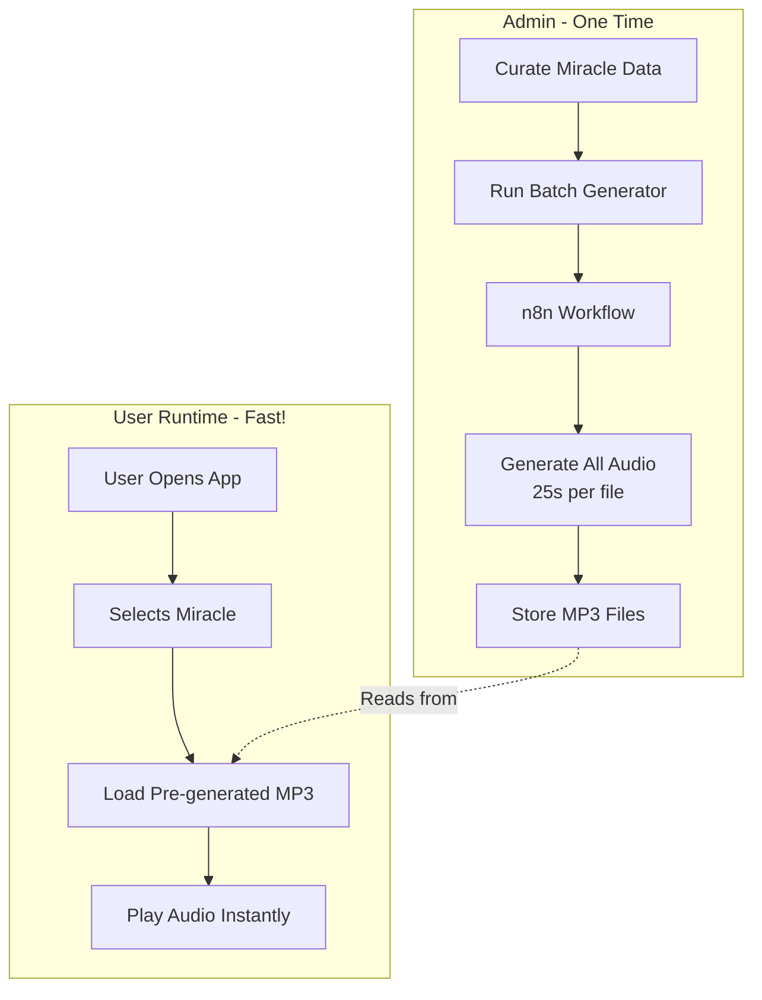

# Via Sancta - Complete Workflow Guide

## 🎯 Understanding the Architecture

### The Problem You Identified
- Real-time audio generation = 25 seconds wait ❌
- User experience suffers with slow responses ❌

### The Solution (Your Approach)
- **Pre-generate all audio files** (batch processing)
- Store as static MP3 files
- Frontend loads instantly ✅

---

## 📋 Complete Implementation Steps

### Phase 1: Data Preparation (Manual Work)

**Time: 1-2 weeks**

1. Follow `data-curation-guide.md`
2. Curate 30-40 miracles from Carlo Acutis sources
3. Fill in all data fields for each miracle
4. Save to `src/data/eucharistic-miracles.json`

**Starter data:** `starter-miracles.json` has 3 complete examples

---

### Phase 2: Batch Audio Generation (One-Time Process)

**Time: 30-60 minutes (automated)**

#### Step 1: Set Up n8n Workflow

1. Import `n8n-workflow-universal-narration.json` into n8n
2. Configure Groq credentials
3. Configure Google Cloud TTS credentials
4. Activate workflow
5. Note webhook URL

#### Step 2: Run Batch Generation

```bash
# Edit the script to set your n8n webhook URL
nano generate-all-audio.sh

# Set: N8N_WEBHOOK_URL="http://your-n8n-url/webhook/via-sancta-narration"

# Run the batch generator
./generate-all-audio.sh
```

**What happens:**
- Script reads all miracles from JSON
- Calls n8n webhook for each miracle (25s per miracle)
- n8n generates script with Groq → converts to audio with Google TTS
- Saves MP3 files to `./public/audio/eucharistic-miracles/`

**Duration for 30 miracles:**
- 30 miracles × 25 seconds = 12.5 minutes
- Run overnight or during lunch break

**Result:**
```
public/
  audio/
    eucharistic-miracles/
      lanciano-750.mp3
      buenos-aires-1996.mp3
      legnica-2013.mp3
      ... (27 more)
```

---

### Phase 3: Frontend Development (React PWA)

**Time: 2-3 weeks**

The frontend simply **loads pre-generated audio files** - no n8n calls!

```typescript
// services/audio.ts
export async function playMiracle(miracleId: string) {
  const audioUrl = `/audio/eucharistic-miracles/${miracleId}.mp3`;
  
  // Instant load - file is already generated!
  const audio = new Audio(audioUrl);
  audio.play();
}
```

**No waiting! No API calls! Just instant playback!** ⚡

---

## 🔄 When Do You Regenerate Audio?

**Scenarios:**

### 1. Adding New Miracles
```bash
# Add new miracle to src/data/eucharistic-miracles.json
# Run batch generator again (only new ones will be generated)
./generate-all-audio.sh
```

### 2. Improving Narration Quality
```bash
# Update n8n prompt template
# Delete old audio files
rm -rf public/audio/eucharistic-miracles/*
# Regenerate all
./generate-all-audio.sh
```

### 3. Changing Voices
```bash
# Update voice selection in n8n workflow
# Delete and regenerate
```

---

## 💾 Storage Strategy

### Development (Local)
```
/Users/dcasteli/Documents/pda/viasancta/public/audio/
```

### Production (Vercel)
- Commit audio files to Git (if total < 100MB)
- OR upload to Vercel public folder during deployment
- OR use external storage (Cloudflare R2, AWS S3) if many tours

**Recommendation for MVP:**
- 30 miracles × ~500KB per audio = ~15MB total
- ✅ Safe to commit to Git and deploy with Vercel

---

## 📊 Cost & Performance

### One-Time Generation Cost
- **Groq:** FREE (14,400 req/day)
- **Google TTS:** FREE (1M chars/month)
- **Time:** 25s × 30 miracles = 12.5 minutes
- **Storage:** ~15MB audio files

### Runtime Cost (User Playing Audio)
- **Vercel bandwidth:** FREE (100GB/month)
- **Latency:** Instant (pre-generated files)
- **User experience:** ⚡ Fast!

---

## 🎯 Summary of Correct Workflow



---

## ✅ Next Steps for You

1. ✅ n8n workflow created and documented
2. ⏭️ **You curate 30-40 miracles** (use `data-curation-guide.md`)
3. ⏭️ Run `generate-all-audio.sh` to batch generate audio
4. ⏭️ Build frontend React app that plays pre-generated files
5. ⏭️ Deploy to Vercel with audio files included

---

## 🚀 Ready to Start?

**Immediate next action:**
- Start curating miracle data using `data-curation-guide.md`
- Use `starter-miracles.json` as template
- Aim for Top 10 Tier 1 miracles first
- Test audio generation with those 10
- Once satisfied, complete remaining 20-30

**The n8n workflow is ready!** Just need the data. 🎉

